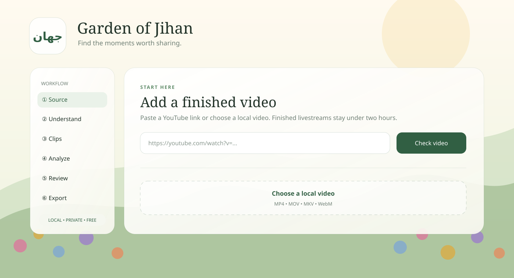

# Garden of Jihan — جيهان



Garden of Jihan is a free, open-source, **local-first Windows application** that turns long-form video into ranked short-form clip candidates through a calm browser-style interface.

## Windows release status

**Public Windows download is temporarily withheld while trusted code signing and Microsoft Store distribution are being completed.**

The application itself is already building and launching successfully on clean Windows runners, but Garden of Jihan will not intentionally publish an unsigned EXE as the recommended end-user download. The release pipeline now requires a valid Authenticode signature before a public release can be created.

Once the signed release is ready, this section will become the main one-click install/download entry point. End users will not need Python, FFmpeg, Git, a subscription, credits, or a paid AI API.

### Private no-install browser handoff

For supervised private testing before trusted Garden of Jihan signing is approved, the repository can produce a separate **portable browser bundle**. The recipient extracts one ZIP and double-clicks `START GARDEN OF JIHAN.cmd`; the normal browser opens the same rich local garden dashboard. Python, the local AI dependencies, FFmpeg, and ffprobe are contained inside the folder. Nothing is installed system-wide, administrator access is not requested, and the server remains bound only to `127.0.0.1`.

This is deliberately not a public executable release. It contains no custom unsigned `GardenOfJihan.exe`; the invisible runtime executables are the checksum-pinned official Python 3.12.10 binaries with a valid Python Software Foundation signature. Its dependency set is hash locked, the complete folder has a SHA-256 file manifest, and the exact ZIP is exercised through launcher, onboarding, UI, caption, framing, shutdown, and Microsoft Defender checks. A manually dispatched CI artifact is retained for only two days and is intended for direct private handoff by the maintainer.

Build it on Windows with Python 3.12 available to the build process:

```powershell
.\scripts\build-portable-browser.ps1 -PythonExecutable .\.venv\Scripts\python.exe
.\scripts\smoke-portable-browser.ps1 -PackageRoot .\dist\GardenOfJihan-Portable
```

The resulting handoff is `dist\GardenOfJihan-Portable-Browser-Windows-x64.zip`. Public distribution continues to require the trusted Authenticode-gated application release.

The private portable and Windows packages include checksum-verified speech and multilingual meaning resources, so the first analysis does not pause for a model download. Video analysis and rendering run locally. Source-development runs may populate a local cache when those resources are not packaged. If the meaning model is unavailable, the UI reports its base-ranking fallback; it never uploads transcripts to a paid or cloud fallback.

The project is designed around four principles:

- **Private by default:** processing happens on the user's computer.
- **Useful without credits:** no token meter, subscription, or required paid AI API.
- **Multilingual by design:** English, Arabic, and Somali are first-class modes.
- **Faithful Qur'an workflows:** Qur'anic recognition must use verified reference data and fail safely when confidence is insufficient.

> **Status: internal/public-beta candidate.** The Windows application, local security boundary, source validation, resumable local projects, Intelligence V2 ranking, manual timing, confidence-gated local audio-visual framing, manual framing controls, styled segment captions, confidence-gated acoustic word highlights, background export pipeline, official YouTube OAuth/resumable-upload integration, bundled media tools, CI/security scans, clean-Windows executable smoke tests, and Microsoft Defender release scans are operational. Checksum-pinned Tanzil installation and fail-safe Surah/Ayah matching are implemented. Qur'an word captions use reference display text only when every locating word maps one-to-one to sufficiently confident local acoustic timestamps; otherwise they remain disabled. Acoustic Qira'at recognition is not implemented or claimed. Trusted Windows distribution, representative Somali and recitation-timing evaluation corpora, robust speaker identity/diarization, production OAuth approval, and audited TikTok Direct Post remain launch blockers.

## Current workflow

1. Paste a supported video URL or select a local file.
2. Choose Auto, Somali, Arabic, or Qur'an mode.
3. Analyze finished videos / finished YouTube livestreams up to two hours.
4. Rank non-overlapping moments using local multilingual embeddings, transcript structure, audio energy, visual activity, and YouTube replay data when available.
5. Preview clips, adjust start/end timing, and select the strongest moments.
6. Choose 9:16, 16:9, or 1:1 output. Vertical clips can use confidence-gated local face/activity framing or a manual fallback.
7. Optionally burn in segment-timed captions or local acoustic word highlights using Garden, high-contrast, or minimal styling.
8. Render clean MP4 clips in a bounded background queue, follow clip-by-clip progress, and save them without freezing the local editor.
9. Optionally publish an explicit export through the official YouTube OAuth/upload API after choosing visibility and required disclosures.

Completed analyses are saved as versioned local project manifests alongside their isolated source files. The dashboard can resume kept clips, timing adjustments, and export settings after an app restart. These projects remain on the computer until the user removes them from the project library; incomplete temporary jobs continue to use automatic retention cleanup.

Supported source validation is structured for YouTube, TikTok, Instagram, and local files. Users are responsible for having the rights and permission to process and republish source media.

Garden of Jihan does **not** include features whose purpose is to evade platform originality, provenance, copyright, or moderation systems. Creative transformation features should make edits genuinely useful and distinct, not spoof platform verification.

## UI direction

The app opens locally in the user's default browser with a light garden aesthetic: layered flowerbeds, soft animated landscapes, and slow swaying falling flowers behind the six-step workflow. Motion automatically reduces when the operating system requests reduced motion.

## Development setup

Contributors can run from source with Python 3.11 or 3.12:

```powershell
python -m venv .venv
.\.venv\Scripts\Activate.ps1
python -m pip install -e ".[dev,ai]"
garden-of-jihan
```

The launcher binds only to `127.0.0.1`, chooses a local port, opens the UI, and generates a per-launch anti-CSRF token.

## Security model

Garden of Jihan is designed as local software, not an internet-facing web service.

- Loopback-only binding (`127.0.0.1`)
- Strict source-host allowlist
- No arbitrary URL fetch endpoint
- Mutation requests require a per-launch token and same-origin request
- No `shell=True` subprocess execution
- Random isolated job directories
- Bounded input duration and upload size
- Content Security Policy and anti-framing headers
- No telemetry by default
- Temporary-job cleanup
- GitHub Actions CI, Bandit, dependency audit, and CodeQL checks
- Windows package smoke-tested by launching the packaged executable on a clean GitHub Windows runner
- Microsoft Defender Antivirus scan before release
- SHA256 checksum and GitHub build-provenance attestation for release artifacts
- Public release workflow requires a valid Authenticode signature

The optional local meaning pass uses the MIT-licensed `intfloat/multilingual-e5-small` model through CPU-only ONNX inference. It adjusts a bounded 10% of the candidate score for within-clip topic coherence and uses semantic similarity to reduce paraphrased repeats. The original base ranking remains available when the model cannot load. Low-resource-language performance, especially Somali varieties, must pass the licensed evaluation framework before release-quality claims are made. See [`docs/SEMANTIC_MODEL.md`](docs/SEMANTIC_MODEL.md).

See [`SECURITY.md`](SECURITY.md), [`PRIVACY.md`](PRIVACY.md), [`CODE_SIGNING.md`](CODE_SIGNING.md), and [`docs/THREAT_MODEL.md`](docs/THREAT_MODEL.md).

The YouTube publisher uses upload-only OAuth, Windows user encryption, and Google's resumable upload protocol. The repository contains no production OAuth credentials. TikTok Direct Post stays disabled until the project has an audited client and supported secure OAuth backend; no browser automation or unofficial API is used. See [`docs/PUBLISHING.md`](docs/PUBLISHING.md).

## Qur'an and Qira'at

The matcher architecture separates:

1. Qur'anic passage identification
2. word-level alignment
3. a future Qira'at-sensitive acoustic evidence layer
4. future reading/transmission confidence

Current releases do not claim Qira'at identification. The UI reports that a reading was not assessed rather than inventing one.

Qur'an word captions are fail-closed. They use the checksum-verified reference display text only after a verified passage match, complete one-to-one word alignment, monotonically ordered local speech-model timestamps, and a minimum per-word acoustic confidence threshold. The UI labels this timing as model-estimated rather than human-verified. If any check fails, the app refuses the Qur'an caption export. This timing evidence does not identify Qira'at, a reader, or a transmission.

The offline matcher uses a reviewed, checksum-pinned Tanzil profile. Quran Foundation / Quran.com remains the intended human-verification layer; its authenticated Content API client secret must never be embedded in this open-source desktop application. See [`data/quran/README.md`](data/quran/README.md).

## Somali language benchmark

The project keeps dialectal speech and normalized spelling as separate annotation fields so regional Somali is not silently rewritten into one standard variety. A local evaluator now reports pairwise, macro-group, worst-group, spelling-variation, and code-switching metrics; a representative licensed gold corpus is still required before release-quality claims can be made. See [`data/somali/README.md`](data/somali/README.md).

## License

MIT. Third-party datasets, models, platform APIs, and media retain their own licenses and terms.
